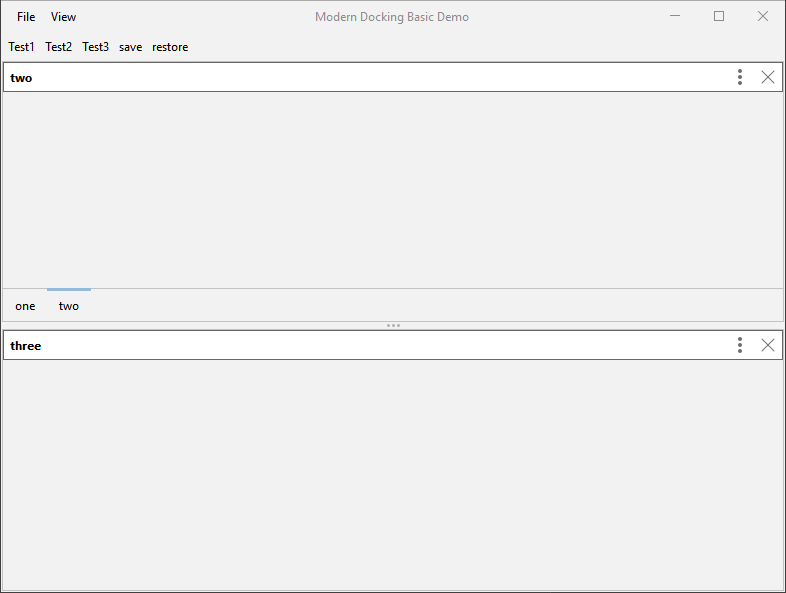
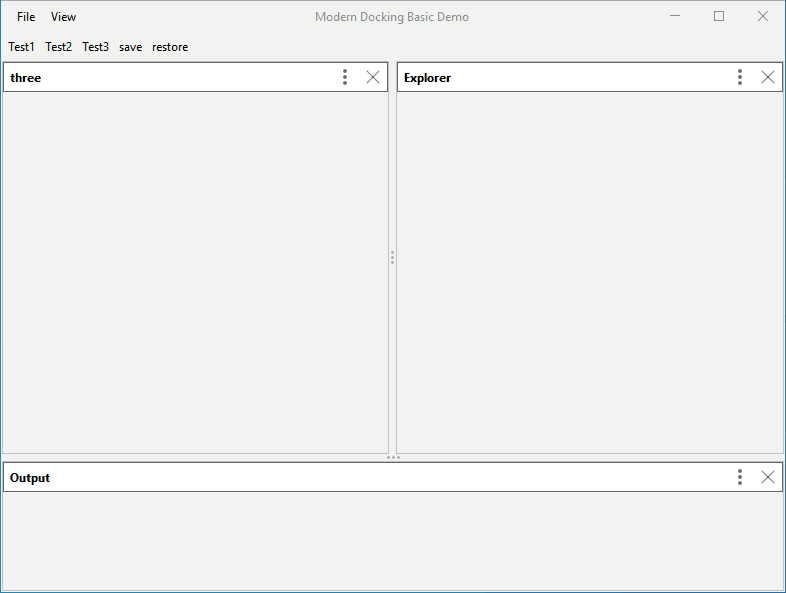
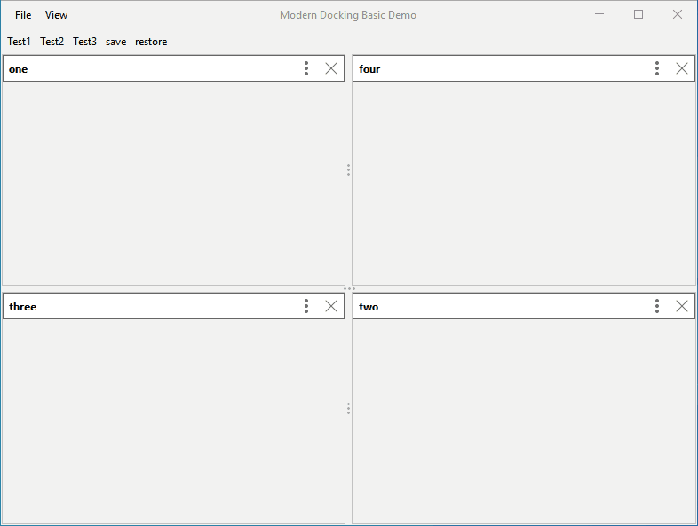
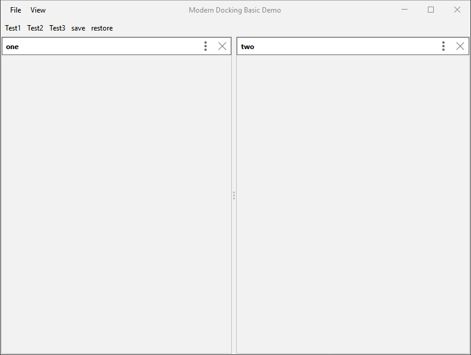
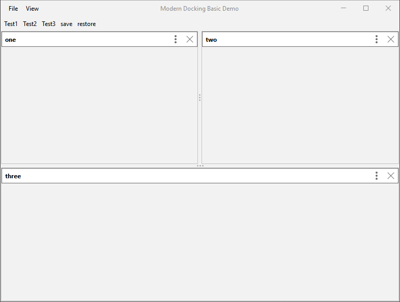
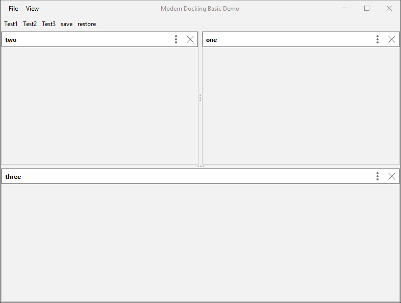
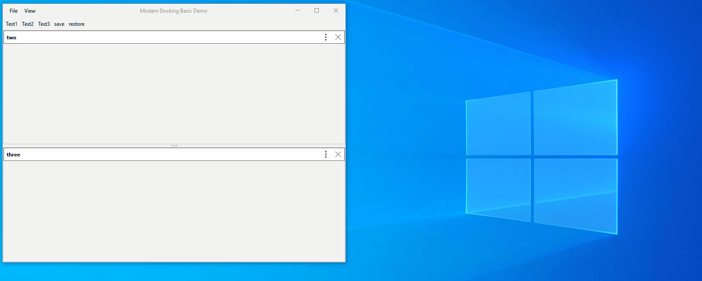
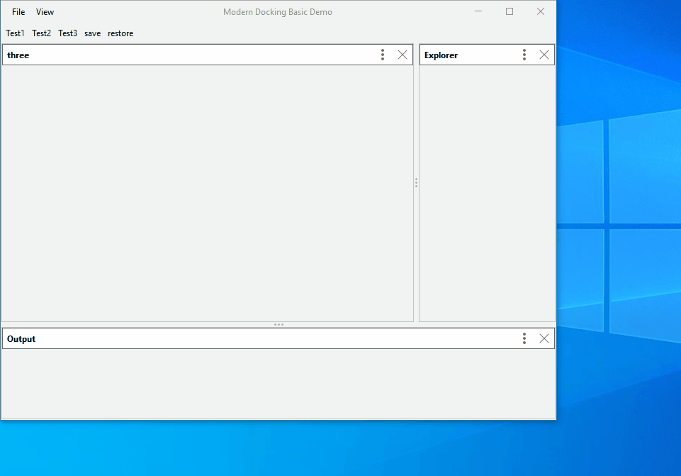
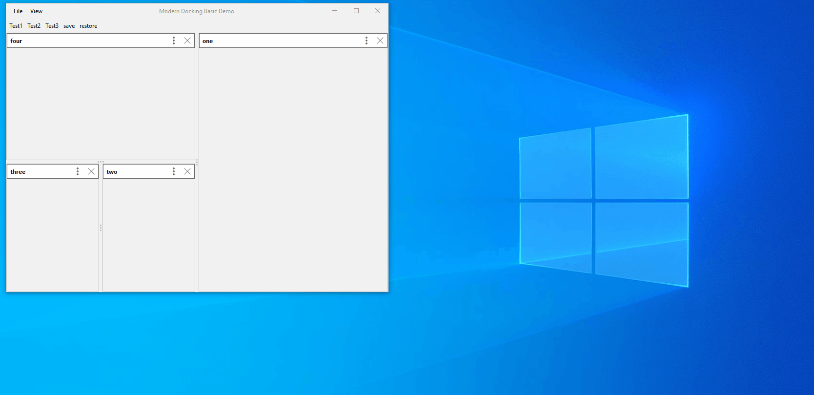
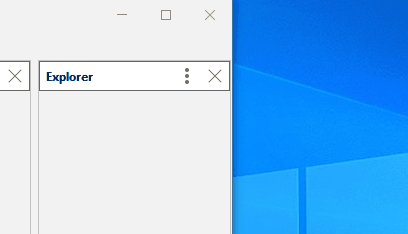

# User Facing Features

## Using Docking Handles to Dock
When dragging a dockable hovering over another dockable will display docking handles in the center of the dockable.
These handles provide easy access to dock to the North, South, East and West regions.

The dockable can also be docked to any of these regions by hovering over the region itself and dropping the dockable.

The root also has North, South, East and West handles to dock the dockable directly to the root of the panel.

## Adjusting Split
Splits can be adjusted and perform continuous layout. Double clicking the split will return it to 50-50 split for the 2 sides.

## Creating Tab Group
Panels can be grouped into tabbed panes by dragging a dockable to the center region of another dockable.

## Closing Panels
Panels can be closed using the X button on their headers. This option can be disabled in the source code.

## Floating a Panel
Panels can be floated as their own window by dragging them by their header and dropping them outside the frame.
This creates a new JFrame with the dockable in it. More dockables can then be docked to this dockable.

## Pinning a Panel
Panels can be set to unpinned with View Mode > Unpinned from the settings button on the panel header.
This option will display the panel on a side toolbar as a button which can be pressed to display the panel.
Clicking outside the panel will return it to the toolbar. To pin the panel and return it to normal, select the View Mode > Pinned option.

## Option Panel in New Window
Panels can be opened in their own window using View Mode > Window.

## Additional Settings Options
Display custom settings options on the settings menu.

[//]: # "-- TODO add some links to blog posts that I will eventually write"
[//]: # "-- TODO come up with what needs to be done for 1.0, might just be more integration at work and then it's done"
